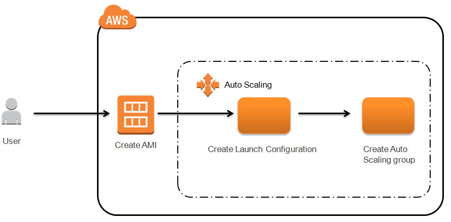

# IAAC using Terraform with AWS as the provider.

## Description

### ASG (Auto Scaling Group)

#### This repo contains several versions of an Auto scaling group.
- creates a launch configuration
- creates an auto scaling group with some instances with amazon linux 2 image.
- creates an auto scaling group with a simple scaling policy using cloudwatch metric monitoring the CPU utiliation .

### Usage:
- if you want to create an auto scaling group with a launch configuration in place you can use it.
### prerequisites
- first make sure you have an AWS account. you can use this link to open an account in AWS.
```
https://portal.aws.amazon.com/billing/signup
```
- git locally installed
- terraform locally installed and AWS credentials are being setup for authentication.

### How to use this code?
```
git clone https://github.com/Saintmori/asg.git
```
- change the directory to asg and run terraform commands.
```
cd asg_v2.0
terraform init
terraform plan
terraform apply

```
### contributors
@saintmori

### License
